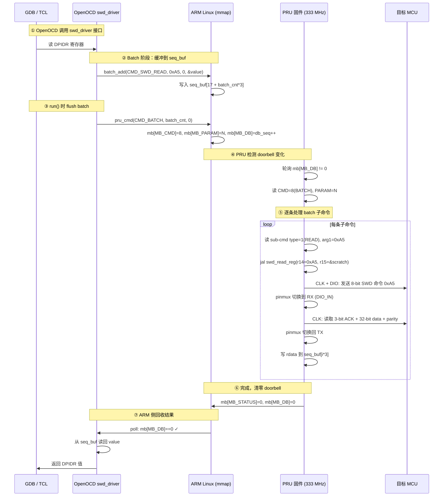

# AM62x PRU-SWD — 架构与数据流

> 基于 TI AM62x PRU-ICSS 实现的高速 SWD (Serial Wire Debug) 协议，将 BeaglePlay/PocketBeagle2 转变为专业的 ARM Cortex-M 调试器。

---

## 一、项目概览

本项目分为两大组件，分别位于两个代码仓库：

| 组件 | 位置 | 语言 | 作用 |
|------|------|------|------|
| **PRU 固件** | `open-pru/examples/am62x_swd/firmware/` | PRU 汇编 (`.asm`) | 在 PRU 上以纳秒级精度直驱 GPIO 实现 SWD 协议 |
| **OpenOCD 驱动** | `openocd/src/jtag/drivers/am62x_pru_swd.c` | C | 实现 `swd_driver` 接口，通过共享内存 Mailbox 与 PRU 通信 |

| 属性 | 值 |
|------|-----|
| 平台 | AM62x (BeaglePlay, PocketBeagle2) |
| PRU 频率 | 333 MHz |
| SWD 速度 | 1–10 MHz 可配置 |
| 构建系统 | Open-PRU + TI PRU CGT v2.3.3 |

---

## 二、硬件层 — PRU GPIO 引脚映射

AM62x 的 PRU GPIO 为**推挽输出**（非开漏），DIO 的 TX 和 RX 分属**不同物理引脚**：

```
       PRU 固件 (汇编)                                 目标 MCU
    ┌──────────────────┐                         ┌──────────────┐
    │ R30.8 (U22)      │──── CLK ────────────────▶│ SWCLK        │
    │ PR0_PRU0_GPO8    │                         │              │
    │                  │                         │              │
    │ R30.9 (V24)      │──── DIO_OUT ───┬────────▶│ SWDIO        │
    │ PR0_PRU0_GPO9    │                │        │              │
    │                  │                │        │              │
    │ R31.6 (AB24)     │──── DIO_IN ◀───┘        │              │
    │ PR0_PRU0_GPI6    │                         │              │
    └──────────────────┘                         └──────────────┘
```

| 功能 | 引脚 | Ball | R30/R31 Bit | PADCONFIG | 地址 | Mode |
|------|------|------|-------------|-----------|------|------|
| SWD_CLK | U22 | GPO8 | R30.8 | PADCONFIG46 | 0x000F40B8 | 5 |
| SWD_DIO_OUT | V24 | GPO9 | R30.9 | PADCONFIG47 | 0x000F40BC | 5 |
| SWD_DIO_IN | AB24 | GPI6 | R31.6 | PADCONFIG62 | 0x000F40F8 | 6 |

**关键约束**：由于 DIO 是推挽输出且 TX/RX 分属不同引脚，在读取 ACK/数据阶段需动态切换 V24 的 pinmux 模式（TX→GPIO 输入）以释放总线，否则 PRU 的强驱动会与目标 MCU 的 SWDIO 输出发生冲突。

---

## 三、软件架构总览

```
┌──────────────────────────────────────────────────────────────────┐
│                        Linux 用户空间                             │
│  ┌──────────┐    ┌──────────────────────────────────────────┐   │
│  │ OpenOCD   │    │  swd_test / pru_swd_test (测试程序)       │   │
│  │  (GDB     │───▶│  mmap → /dev/mem → PRU DRAM (0x30040000) │   │
│  │   Server) │    └──────────────────────────────────────────┘   │
│  └────┬─────┘                                                    │
│       │ swd_driver 接口                                           │
│       ▼                                                          │
│  ┌──────────────────────┐                                        │
│  │ am62x_pru_swd.c      │  OpenOCD adapter driver                │
│  │  - pru_swd_read_reg  │                                        │
│  │  - pru_swd_write_reg │                                        │
│  │  - pru_swd_run       │  (run_queue / batch 机制)              │
│  │  - pru_cmd()         │  ← 门铃协议 (doorbell)                  │
│  └────────┬─────────────┘                                        │
│           │ mmap /dev/mem                                         │
└───────────┼──────────────────────────────────────────────────────┘
            │
    ════════╪══════ ARM ↔ PRU 共享内存边界 ═══════════════════════
            │
┌───────────┼──────────────────────────────────────────────────────┐
│  PRU DRAM (物理地址 0x30040000, 8 KB)                             │
│  ┌──────────────────────────────────────────────────────┐        │
│  │  0x0000 – 0x0FFF : PRU 固件代码 (.text)                │        │
│  │  0x1000 – 0x103F : Mailbox 区域                        │        │
│  │  0x1044 – 0x10FF : seq_buf (batch 命令缓冲)            │        │
│  │  0x1100 – 0x1EFF : scratch (读数据暂存)                │        │
│  └──────────────────────────────────────────────────────┘        │
│                                                                  │
│  ┌──────────────────────────┐                                     │
│  │  PRU 固件 (main.asm)     │  主循环：轮询 doorbell               │
│  │  333 MHz, 单周期指令      │                                     │
│  │                          │                                     │
│  │  ┌──────────────────┐   │                                     │
│  │  │ swd.asm           │   │  SWD 协议原语                       │
│  │  │  - tx_bits        │   │                                     │
│  │  │  - rx_bits        │   │                                     │
│  │  │  - turnaround_*   │   │                                     │
│  │  │  - swd_read_reg   │   │                                     │
│  │  │  - swd_write_reg  │   │                                     │
│  │  │  - swd_line_reset │   │                                     │
│  │  │  - swd_jtag_to_swd│   │                                     │
│  │  └──────────────────┘   │                                     │
│  └──────────────────────────┘                                     │
└──────────────────────────────────────────────────────────────────┘
```

---

## 四、通信协议 — Mailbox + Doorbell

ARM 与 PRU 通过 PRU DRAM 中固定偏移的 **Mailbox** 进行同步通信。ARM 写入命令参数后递增 doorbell；PRU 轮询 doorbell 变化后执行，执行完毕清零 doorbell。

### 4.1 Mailbox 内存布局 (偏移 0x1000)

| 偏移 | 名称 | 方向 | 宽度 | 含义 |
|------|------|------|------|------|
| `0x00` | MB_CMD | ARM → PRU | 32-bit | 命令类型 |
| `0x04` | MB_PARAM | ARM → PRU | 32-bit | 参数（SWD cmd byte / idle cycles / batch count） |
| `0x08` | MB_WDATA | ARM → PRU | 32-bit | 写数据 |
| `0x10` | MB_RDATA | PRU → ARM | 32-bit | 读数据结果 |
| `0x14` | MB_ACK | PRU → ARM | 32-bit | ACK 码（1=OK, 2=WAIT, 4=FAULT） |
| `0x18` | MB_STATUS | PRU → ARM | 32-bit | 状态（0=成功, 1=失败） |
| `0x1C` | MB_SPEED | ARM → PRU | 32-bit | 速度参数（DELAY 宏的迭代计数 r18） |
| `0x24` | MB_RDBUFF | PRU → ARM | 32-bit | 缓存的 RDBUFF（读优化） |
| `0x28` | MB_FLAGS | PRU → ARM | 32-bit | bit0=是否有有效的 RDBUFF 缓存 |
| `0x40` | MB_DB | 双向 | 32-bit | Doorbell — ARM 写入递增序列号，PRU 清零 |
| `0x44` | seq_buf | 双向 | 可变 | Batch 命令队列，每条子命令 3 × 32-bit |

### 4.2 命令集

| CMD | 宏 | 功能 |
|-----|-----|------|
| 1 | `CMD_SWD_READ` | 单次 SWD 读寄存器 |
| 2 | `CMD_SWD_WRITE` | 单次 SWD 写寄存器 |
| 3 | `CMD_LINE_RESET` | SWD 线复位（55 + 2 个时钟周期） |
| 4 | `CMD_JTAG_SWD` | JTAG → SWD 切换序列（136 bits） |
| 5 | `CMD_IDLE` | 发送指定数量的空闲时钟周期 |
| 6 | `CMD_ABORT` | 发送 ABORT 寄存器写（清除错误标志） |
| 7 | `CMD_CONNECT` | 复合操作：线复位 + JTAG-SWD 切换 + 读 DPIDR + 上电 CTRL/STAT |
| 8 | `CMD_BATCH` | 批量处理 seq_buf 中的混合子命令（读/写/空闲） |
| 9 | `CMD_BRD` | 批量 N 次 AP DRW 读取 + 自动 RDBUFF 缓存 |

---

## 五、核心数据流 — 以一次 SWD 读操作为例



### 详细步骤说明

1. **OpenOCD 调用** — GDB/TCL 触发读寄存器，进入 `pru_swd_read_reg()`
2. **Batch 缓冲** — 非 RDBUFF 的读操作不立即发送，而是写入 `seq_buf`（`batch_add`），等待 `pru_swd_run()` 统一 flush
3. **特殊处理** — RDBUFF 读（`APNDP=0, A32=3`）必须立即执行，优先使用 PRU 缓存的 MB_RDBUFF 值
4. **写操作** — `pru_swd_write_reg()` 先 flush 所有待处理的读，再立即发送写命令（写可能改变 AP 状态）
5. **Doorbell 通知** — ARM 写入 `MB_DB = db_seq++`，`__asm__ volatile("" ::: "memory")` 编译屏障保证写入顺序
6. **PRU 轮询** — PRU 固件在 `poll:` 循环中持续检查 `MB_DB != 0`
7. **PRU 执行** — 逐条处理 batch 子命令，调用 `swd_read_reg` / `swd_write_reg` / `swd_idle_cycles`
8. **ACK 返回** — 每条子命令的结果（rdata + ack）写回 seq_buf
9. **完成通知** — PRU 写 `MB_STATUS`，清零 `MB_DB`
10. **结果回收** — ARM 侧 `pru_cmd()` 检测 doorbell 归零后返回，OpenOCD 从 seq_buf 读取各子命令的结果

---

## 六、OpenOCD 驱动设计要点

### 6.1 Batch 批量机制（性能关键）

```c
static void batch_add(uint32_t type, uint32_t a1, uint32_t a2, uint32_t *rp)
{
    uint32_t off = 17 + batch_cnt * 3;  // seq_buf 起始于 MB+0x44 = 字偏移 17
    mb[off] = type; mb[off + 1] = a1; mb[off + 2] = a2;
    batch_ptr[batch_cnt] = rp;          // 记录返回指针
    batch_cnt++;
}
```

- **读操作默认缓冲**，`pru_swd_run()` 时一次性 flush
- **写操作立即发送**，并在发送前 flush 所有缓冲读
- **BATCH_MAX = 290**，seq_buf 使用空闲 DRAM 区域 0x1100–0x1EFF (~3.5 KB)
- 当 `batch_cnt >= BATCH_MAX` 时自动 flush

### 6.2 RDBUFF 缓存优化

每次 AP 读后 PRU 自动执行一次 DP RDBUFF 读并缓存到 `MB_RDBUFF`，设置 `MB_FLAGS`。后续 OpenOCD 遇到连续 RDBUFF 读时直接使用缓存值，省去一次 PRU 往返。

```c
if (!(cmd & SWD_CMD_APNDP) && ((cmd >> 3) & 3) == 3 && (mb[MB_FLAGS] & 1)) {
    if (value) *value = mb[MB_RDBUFF];  // 缓存命中
    mb[MB_FLAGS] = 0;
    return;
}
```

### 6.3 速度控制

```c
static int speed_coeff = 55000, speed_offset;  // 可通过 TCL 命令 speed_coeffs 调整

// kHz → delay 值
*s = DIV_ROUND_UP(speed_coeff, khz) - speed_offset;

// delay 值 → kHz
*khz = (speed_coeff + d/2) / d;
```

延迟通过 PRU 汇编中的 `DELAY` 宏实现，`r18` 为迭代计数，每迭代 1 次 = 2 个 PRU 周期（@333 MHz ≈ 6 ns）。

### 6.4 TCL 接口

```
am62x_pru_swd speed_coeffs <coeff> <offset>
```

### 6.5 初始化流程

```
am62x_init()
  → 检查 transport 是否为 swd
  → 检查 /sys/class/remoteproc/remoteproc1/state == "running"
  → open /dev/mem + mmap PRU DRAM (0x30040000, 8 KB)
  → 初始化 mailbox: MB_DB=0, MB_SPEED=jtag_delay, DMB ISHST
```

---

## 七、PRU 固件设计要点

### 7.1 文件结构

```
firmware/
├── main.asm      # 主循环 + mailbox 命令分发 (CMD_READ/WRITE/BATCH/...)
├── swd.asm       # SWD 协议原语 (tx_bits, rx_bits, turnaround, read/write reg)
├── rsc.c         # 资源表 (RPMsg vdev for kernel compat, 固件不使用 RPMsg)
└── am62x-sk/
    └── pruss0_pru0_fw/
        └── ti-pru-cgt/
            ├── makefile
            └── linker.cmd
```

### 7.2 寄存器约定

| 寄存器 | 用途 |
|--------|------|
| `r3.w2` | C 可调用函数的返回地址（`swd_read_reg`, `swd_write_reg` 等） |
| `r28.w0` | 内部子程序的返回地址（`tx_bits`, `rx_bits`, `turnaround_*` 等） |
| `r4` | Mailbox 基地址（持久，整个主循环保持不变） |
| `r14`, `r15` | `swd_read_reg` / `swd_write_reg` 的参数（cmd byte, data/value ptr） |
| `r18` | DELAY 宏的速度参数（由 `swd_set_speed` 设置） |
| `r19` | DELAY 宏 clobber（临时变量，不破坏 r28.w0） |

### 7.3 关键时序路径

**TX 一个 bit：**
```
CLK_LO → set/clear DIO (R30.t9) → DELAY → CLK_HI → DELAY
```

**RX 一个 bit：**
```
DELAY → CLK_HI → sample R31.9 (qbbc) → DELAY → CLK_LO
```

**Turnaround（不使用 DELAY，最小化 TRN 开销）：**
```
CLK_LO → 写 PADCFG 切换模式 → 短固定延迟 (~55 ns) → CLK_HI → 短延迟 (~35 ns) → CLK_LO
```

### 7.4 动态 Pinmux 切换（规划中）

为解决推挽输出冲突，需要动态切换 V24 的 pinmux：

```
TX 模式: V24 PADCONFIG = 0x00040005  (Mode 5: PRU_GPO9, 强驱动)
RX 模式: V24 PADCONFIG = 0x00050000  (Mode 0: GPIO input + pull-up)
```

需先解锁 PADCONFIG 寄存器（KICK0=0x68EF3490, KICK1=0xD172BC5A），切换开销约 ~10 PRU 周期（~30 ns）。

### 7.5 SWD 读/写事务流程

```
swd_read_reg(r14=cmd_byte, r15=&data_buf):
  1. tx_setup          — DIO 切为输出
  2. tx_bits(cmd, 8)   — 发送 8-bit SWD 命令
  3. turnaround_input  — DIO 切为输入+pullup
  4. rx_bits(ack, 3)   — 读 3-bit ACK
  5. rx_bits(data, 32) — 读 32-bit 数据 (write to *r15)
  6. 读 1-bit parity
  7. turnaround_output — DIO 切回输出
  返回 r14 = ACK

swd_write_reg(r14=cmd_byte, r15=value):
  1. tx_setup → tx_bits(cmd, 8)
  2. turnaround_input → rx_bits(ack, 3)
  3. 内联 TRN → 逐 bit 发送 32-bit data + inline parity
  返回 r14 = ACK
```

---

## 八、目录结构

```
am62x_swd/
├── README.md                           # 本文档
├── makefile                            # 顶层构建脚本
├── openocd.cfg                         # OpenOCD 配置示例
├── deploy_swd.sh                       # 固件部署脚本
├── pinmux_switch.py                    # Pinmux 配置工具
├── firmware/
│   ├── main.asm                        # PRU 主循环 + 命令分发
│   ├── swd.asm                         # SWD 协议原语
│   ├── rsc.c                           # 资源表
│   └── am62x-sk/
│       └── pruss0_pru0_fw/
│           └── ti-pru-cgt/
│               ├── makefile            # TI CGT 编译配置
│               └── linker.cmd          # 链接脚本
└── linux/
    └── swd_test/
        ├── Makefile
        ├── swd_test.c                  # 早期测试程序
        └── pru_swd_test.c              # Mailbox 直连测试
```

---

## 九、构建与部署

```bash
# 1. 编译 PRU 固件
cd /home/zhangjiance/Code/open-pru/examples/am62x_swd
make clean && make

# 2. 部署到目标设备
sudo cp firmware/am62x-sk/pruss0_pru0_fw/ti-pru-cgt/generated/*.out \
    /lib/firmware/am62x-pru0-fw

# 3. 启动 PRU (通过 remoteproc)
sudo sh -c 'echo stop  > /sys/class/remoteproc/remoteproc1/state'
sudo sh -c 'echo start > /sys/class/remoteproc/remoteproc1/state'
cat /sys/class/remoteproc/remoteproc1/state   # 应显示: running

# 4. 启动 OpenOCD
openocd -f openocd.cfg
```

---

## 十、当前开发状态

| 状态 | 项目 |
|------|------|
| ✅ 已完成 | PRU 固件编译、部署、GPIO 波形验证（逻辑分析仪确认 9.5/55.6 MHz） |
| ✅ 已完成 | OpenOCD `adapter_driver` + `swd_driver` 全接口实现 |
| ✅ 已完成 | Batch 批量命令机制（BATCH_MAX=290） |
| ✅ 已完成 | RDBUFF 缓存优化 |
| ✅ 已完成 | Line Reset、JTAG-to-SWD 切换、自定义序列 |
| ✅ 已完成 | 速度系数可调（TCL `speed_coeffs` 命令） |
| ⚠️ 已知问题 | DIO 推挽输出冲突 — 需动态 pinmux 或外接电阻 |
| 🔄 下一步 | 实现动态 pinmux 切换，端到端连接真实目标 MCU 调试 |

